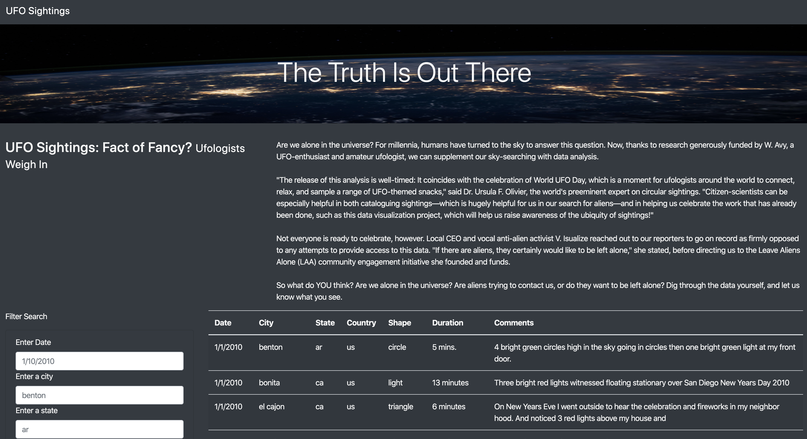
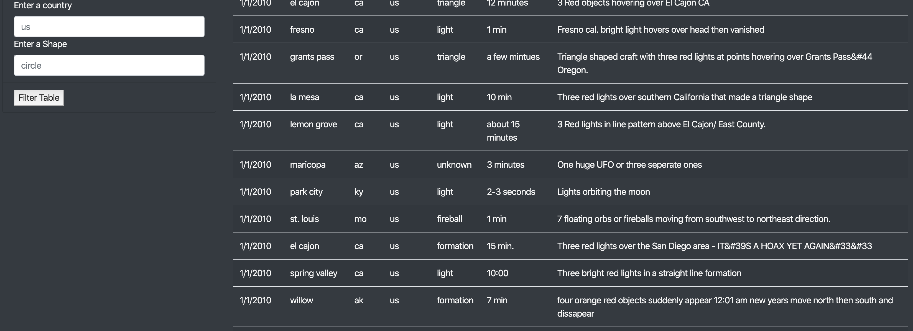

# Project UFOs

### Purpose of project 
Develop and deploy a dynamic web page using UFO database. 

### Technology used
Javascript, HTML, CSS and a UFO database
 
### Recommendation for further development
* Data table: Improve table layout to a more compact design and overall layout.
* Additional filter for Duration data attribute.
* A wildcard filter for the comments section can be used to filter based on wildcard or keyword search.

### Example

